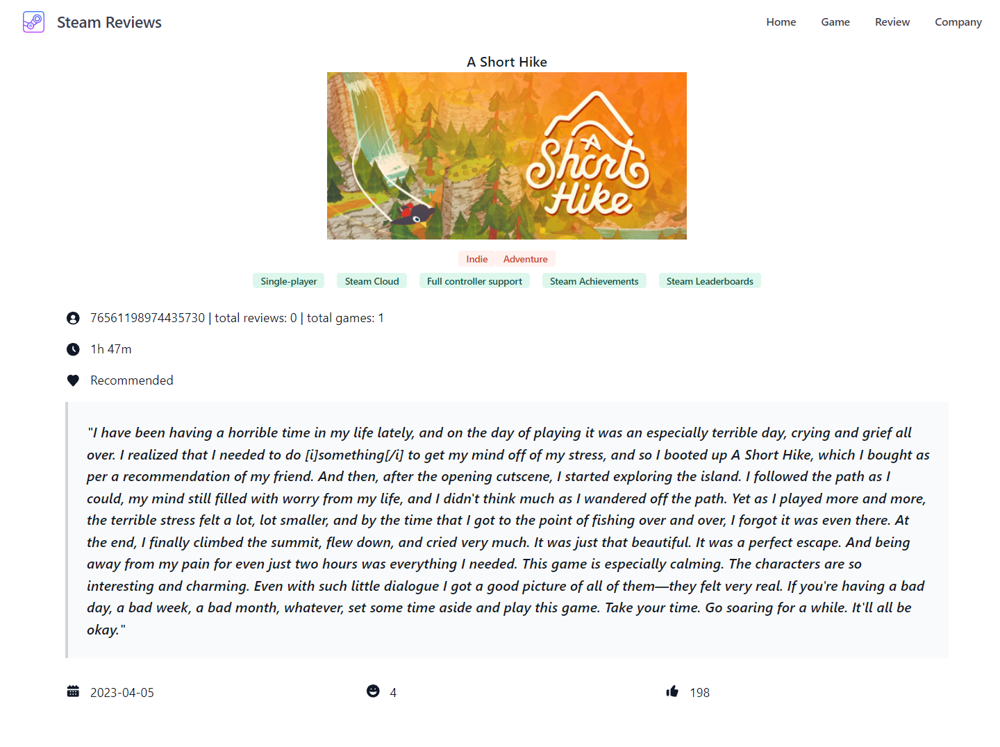
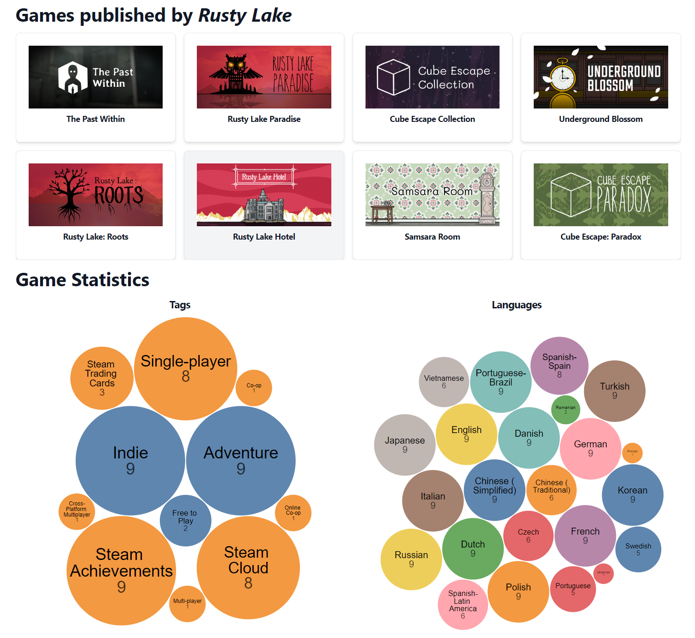

# Steam Review
[Demo Link](http://steamreview.tong-hu.com/)

## Introduction
-------
### Project Goal
Steam is the largest PC gaming platform, providing browsing,  purchasing, downloading, and reviewing functionality.  It also contains a wealth of information about PC games as well as player feedback and reviews. However, the platform currently does not allow users to search for and learn about games in greater depth based on user reviews and game companies. As a result, we created a platform called the Steam Reviews to provide users with a more diverse platform for searching games other than just the standard game metadata. This enables users to better understand and expand their gaming platforms and perspectives (games they are or may be interested in) by reading other users' reviews and reactions to games and games released by a specific company.

### Application Functionality
With our application, users can: search games, reviews based on a plethora of criteria; view game details and review statistics of each game, across languages and time; interactively learn about each company, including their game development focus (genres), and localization efforts; view top games list curated by us; and watch reviews for each game in random.

## Data Source
-------
[Steam Games Dataset](https://www.kaggle.com/datasets/fronkongames/steam-games-dataset)
- **Description:** This dataset contains information about over 85,000 Steam games, including game names, release dates, expected owners, and prices.
- **Usage of Data:** Break Games Dataset into four tables: games, companies, categories, genres.

[Steam Reviews Dataset](https://www.kaggle.com/datasets/kieranpoc/steam-reviews)
- **Description:** This dataset contains information and content about over 140m reviews of the games on Steam.
- **Usage of Data:** Break Reviews Dataset into two tables: reviews, authors. Extract the review content for NoSQL solution.

## Database Design
-------
### ER Diagram

### Tables Schema

## Pages
-------
### Home Page

  

    
    
Home Page

  

At the top of the Home page, the navigator will lead users to other sections: Home, Game, Review, and Company. Below these, the platform enhances user engagement by showcasing the top ten games, ranked by positive ratings, offering a dynamic visual display. Additionally, visitors will encounter random reviews of a randomly selected game, updated every 10 seconds to provide fresh insights. Clicking on game or review will take user to the page with detailed information.

### Game Search

  

    
    
Search Games by Name

  

  
  

     
    
Search Games by Genre

  

The Games button on the Home Page will direct the user to the Game Search screen. Users can input the prefix of the game name and filter the result with following options: support operating systems, genres and categories the games belong to, the price range of the games, the audio and text language supported by the game, release date within a specific period of time, and select the sorting criteria (by name, price, release date, and positive rate) to sort the results in ascending or descending order.

### Game Detail

  

    
    
Game Detail Page

  

  
  

     
    
Game Description

  

  

     
    
Games Statistics

  

Users can access Game Details by clicking on a specific game, and the detailed information about the game will display - the game's image along with its release date, developing company, and publishing company, the game's price, positive rates represented by stars, and the genres and categories the game belongs to. Users can also access other related sites of the game by clicking the Official Website and Metacritic buttons. 

The description, support info, and review statistics will show more details about the game, including the supported operating system and the text language of the game. The review statistics show the number of reviews in each language and positive review rate by language, along with a timeline showing the positive and negative review counts for each month within a given time period. 

The bottom of the game detail page are reviews of the game with infinite scroll, and users can search the reviews by various criteria such as review created time, minimum playtime of the player when posting a review, content language and other filter conditions. 

### Review Search

  

    
    
Review Search

  

  
  

     
    
Review Detail

  

Reviews is a page that facilitates user searches. Users first have to type in the game name and then filter the result by selecting minimum playtime at review, the time range when the review was released, review content language, did the review recommend the game or not, whether the review was posted during early access time, and select sorting the result by most helpful (number of thumb ups), newest, or fun (number of funny) in ascending or descending order.

### Companies 

  

    
    
Review Search

  

  
  

     
    
Review Detail

  

The page of Companies is divided into 2 parts: most popular games and most popular genres. The most popular games will display images of the games, which can be viewed by swiping left and right. Following that, there is a list that includes the game's name, genre, and price. The most popular genres display images of the hottest games in that genre, which can also be viewed by swiping left or right. Clicking on a specific company will take you to the Company Details page.

Company detail page will show the games developed and published by the company, along with the statistical plot showing the count of tags in each genre and categories the games have, and the number of languages of these games supported. These statistics will illustrate in summary the company's area of focus within the gaming industry .

## Performance Evaluation
-------

|                    | Original | +Query optimization | +Indexing  | +Caching  |
|--------------------|:--------:|:-------------------:|:----------:|:---------:|
|    review search   |  ~ 229s  |        ~ 221s       |    ~ 16s   |    < 1s   |
|  best 10 companies |   ~ 15s  |          /          |      /     |    < 1s   |
|     game search    |   ~ 6s   |          /          |    ~ 4s    |    < 1s   |
| company statistics |   ~ 2s   |          /          |      /     |    < 1s   |
|   review timeline  |   ~110s  |          /          |    ~ 1s    |    < 1s   |

### Optimizations
**No Optimization/Original**

After observation, most time-consuming queries have one of the following properties:
- Selection not pushed in. This results in excessive tuples during JOIN operations. In “Review Search”, this is one of the issues with the original query.
- Aggregation after JOIN. If the result of the query depends on the correct JOIN of large tables, pushing in selection will not be viable. In “Best 10 Companies”, this is the case and normal query optimization cannot improve the performance.
- Inefficient indexes. If there are limited indexes, or indexes don't fit the query well, queries will still be slow. In query “Review Search”, “Game Statistics”, “Review Timeline”, introducing new indexes drastically improves the performance.

**Query Optimization**

Due to the inherent nature of each query, query optimization is only applicable to certain queries. In our app, we applied selection push-ins and we observed moderate performance improvements. This is because, by pushing the game name prefix selection into the Game table, it reduces the size of the resulting table that is on the left side of the subsequent join. This reduces the number of final tuples and hence removes the need for redundant selection after.

**Indexes**

If the query relies on range or equivalence selections, indexes are particularly powerful.
- For “Review Search”, in the Game table, index on (game_name) makes prefix search very fast. And in the Review table, the composite index (app_id, thumb_up) helps to find all reviews of a game in descending order of thumb ups, which hugely narrows the final range to filter.
- For “Game Search”, in the Game table, index on (game_name) also speeds up prefix search. However, since the hotspot is calculating the positive rate of each game and ordering according to the positive rate, the index doesn’t provide drastic performance improvements.
- For “Review Timeline”, in the Review table, index (app_id, time_created_ recommended) is exactly tailored for this query: It allows fast computation of positive/negative reviews in each time interval, for a given game.Therefore, the computation efficiency is greatly improved.

**Caching**

If the query is very computation-heavy but has limited input space, caching is very helpful. In all 5 queries listed above and more, we introduced caching to reduce MySQL workload by caching the result in a Redis key-value database. The route and params form the key, while the JSON response is the value. If an incoming query matches exactly the route and params, then the JSON in Redis is returned directly without consulting MySQL. This caching strategy is reasonable because the MySQL database is mostly static and cached data has a long period of validity.
- For “Best 10 Companies”, this strategy is particularly useful because the input space of this query is very small (only 1 integer parameter). All results can be covered in little time, which is quite beneficial for the frontend experience.
- For “Review Search”, this method works but is not perfect, since there are many more parameters in the search functionality, and it is impossible to exhaust all of them. However, considering the time cost, it is still effective against potential popular searches.

## Project Info
-------
This project is part of UPenn CIS5500 final project. Following are related resources:
- [Final Report](https://docs.google.com/document/d/1rVcw1OfUobVquCSOcAc_tX3RddWagCr3DygzSmCA-g8/edit?usp=sharing)
- [Demo Video](https://drive.google.com/file/d/1WztIIsCWFe5IJGypWjBgFzm-o5mmamJN/view)
- [Final Presentation](https://docs.google.com/presentation/d/1Va3NtXY2bR9nLvgR_n2FwSQehBc_9Y9A4SJvdD-5SLo/edit?usp=sharing)

## Authors
-------
(alphabetical order with equal contribution)
- Siyuan Fu
    [GitHub](https://github.com/IwakuraRein)
- Tong Hu
    [GitHub](https://github.com/TongHuoAo) | 
    [Personal Website](https://www.tong-hu.com/) 
- Yuanqi Wang
    [GitHub](https://github.com/plasmas) | 
    [Personal Website](https://www.yqwong.com/) 
- Zhiyan Zeng
    [GitHub](https://github.com/hailiezzy)