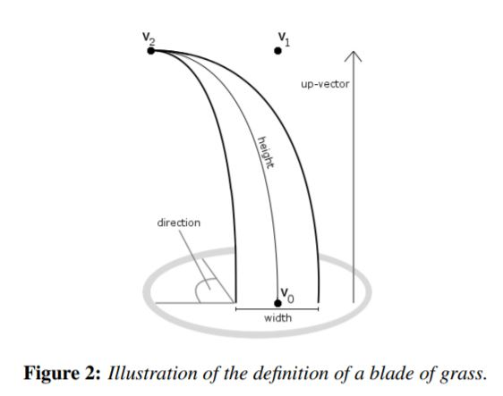
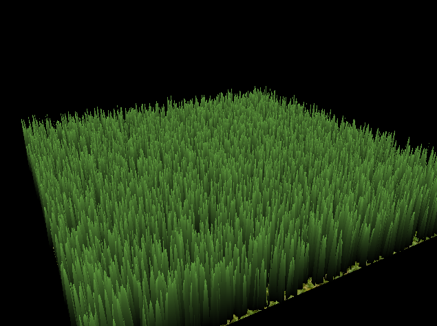
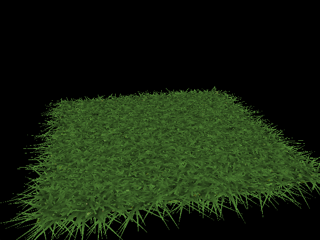
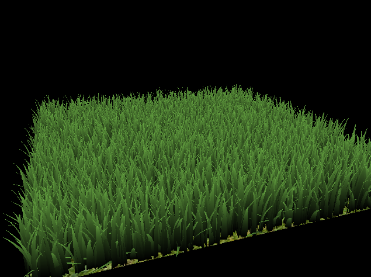
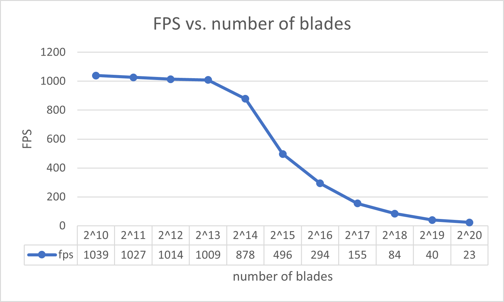
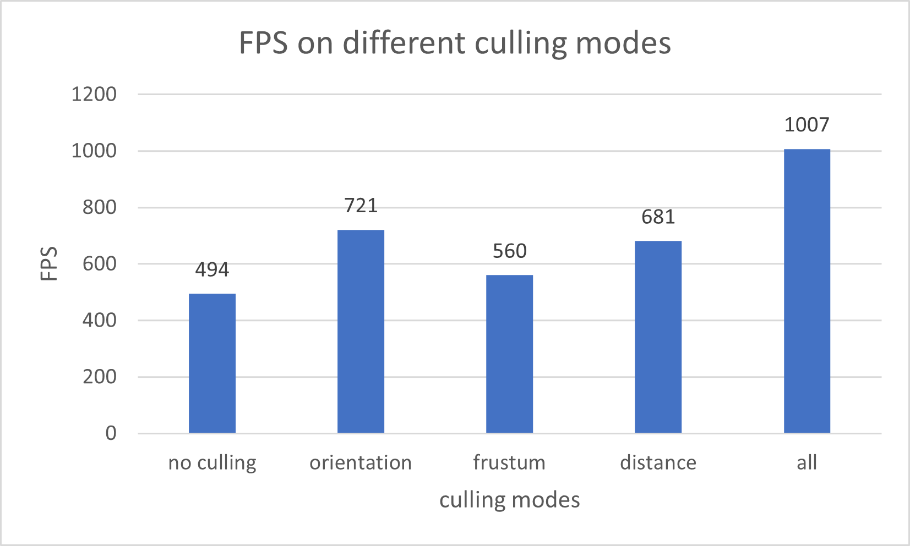

# Vulkan Grass Rendering
[GitHub Repo](https://github.com/TongHuoAo/Project5-Vulkan-Grass-Rendering)

This project is a Vulkan-based application designed to render realistic grass with an integrated physics simulation, utilizing compute shaders. The implementation is inspired by the techniques described in the paper [Responsive Real-Time Grass Rendering for General 3D Scenes](https://www.cg.tuwien.ac.at/research/publications/2017/JAHRMANN-2017-RRTG/JAHRMANN-2017-RRTG-draft.pdf).

All features are tested on: **Windows 11, Ryzen 7 1700X @ 3.4GHz 16GB, RTX 2060 6GB**

## Simulation Details
-------

The physical simulation of grass in this project models each blade as an individual entity, influenced by three primary forces:

1. **Gravity**: Bends the grass blades downward.
2. **Recovery**: Acts against gravity, helping the blades maintain their upright position.
3. **Wind**: Varies based on location and time, adding dynamic movement to the grass.

Each grass blade is geometrically represented by a Bezier curve, composed of multiple control points.

## Features
-------

### Forces Simulation

This application simulates the effects of gravity, recovery, and wind on grass blades. Below are visual demonstrations of these simulations:

#### Gravity Effect

  

    
    
Original (No Force)

  

  
  

     
    
Gravity Only

  

#### Comprehensive Forces

  

    
    
Gravity & Recovery

  

  
  

     
    
Gravity, Recovery & Wind

  

### Culling Optimization

To enhance performance and minimize the number of grass blades rendered, the application employs three types of culling:

* **Orientation Test**: Determines visibility based on the blade’s orientation relative to the camera.
* **View-Frustum Test**: Ensures only blades within the camera’s field of view are rendered.
* **Distance Test**: Reduces detail for distant blades, saving computational resources.

#### Orientation Test

  

    
    
Original (No Culling)

  

  
  

     
    
Orientation Test

  

#### View-Frustum and Distance Tests

  

    
    
View-Frustum Test

  

  
  

     
    
Distance Test

  

## Performance Analysis
-------

### Impact of Grass Blade Quantity

The quantity of grass blades significantly affects rendering performance. Below is an analysis of Frames Per Second (FPS) against various blade counts.

This plot shows the fps under different number of blades with all culling mode disabled.

From above plot, we can see that when the number of blades is small (< $2^{13}$), fps is relative stable (~1000 fps). In this case, the bottleneck for rendering is not the number of blades. After this point, as the number of blades increased, the fps drops quickly, since when there are too many blades to be rendered, the computation becomes intense, and the number of blades becomes the bottleneck of scene rendering.

### Efficiency of Culling Techniques

Culling helps in reducing the rendering workload by limiting the number of grass blades processed.

This plot shows the fps under different culling modes with number of blades equals to $2^{15}$, and all fps value is recorded without changing camera position.

From above plot, we can see that without any culling, the fps is low since all blades need to be rendered. When enable orientation culling, rendering performance is better since the blades are all 2D and we will not render the blades whose orientation is aligned with the direction of camera view, and this reducing the rendering workload the most among three culling modes. 

With distance culling enabled, we can also see the improvement of performance in rendering the grass. This fps value is related to the distance between the grass and the camera. When the camera is distant from the grass, the number of blades need to be rendered is smaller, and thus the fps is higher (~1000 when the camera is too far and no blades need to be rendered).

When enabling frustum culling, and dive into the grass, we can see the fps is higher compared with looking the overall grassland, since when we dive into the grass, the blades out of the scope will not be rendered.

With all culling modes enabled, the fps is much higher than any of other scenario, since we exclude all blades that do not need to be rendered, thus improving the performance a lot.

## Reference
-------

[Responsive Real-Time Grass Rendering for General 3D Scenes](https://www.cg.tuwien.ac.at/research/publications/2017/JAHRMANN-2017-RRTG/JAHRMANN-2017-RRTG-draft.pdf)